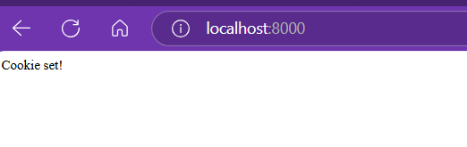

# Mise en place d'un Serveur HTTP Python avec CGI

Ce document décrit comment configurer un serveur HTTP simple en Python avec le support de CGI (Common Gateway Interface), permettant de servir du contenu dynamique.

## Prérequis

*   Python 3.x installé
*   Un éditeur de texte
*   Un terminal ou invite de commande

## Étapes

### 1. Créer un script CGI (exemple : `hello.py`)

Utilisez un éditeur de texte pour créer un fichier `hello.py`. Voici un exemple de script de base :

```python
#!/usr/bin/env python3
print("Content-type: text/html\n")
print("<html><body><h1>Hello, World!</h1></body></html>")
```

Ce script génère une simple page HTML contenant le texte "Hello, World!".

### 2. Rendre le script exécutable

Dans un terminal, naviguez jusqu'au répertoire contenant le fichier `hello.py` et exécutez la commande suivante pour rendre le script exécutable :

```bash
chmod +x hello.py
```

Cela permet au serveur d'exécuter le script CGI.

### 3. Démarrer le serveur HTTP avec CGI

Dans le même répertoire, exécutez la commande suivante pour démarrer un serveur HTTP simple avec le support de CGI :

```bash
python3 -m http.server --cgi
```

Cela lance un serveur HTTP qui écoute sur le port 8000.

*   `python3 -m http.server` : Lance le module `http.server` pour créer un serveur HTTP de base.
*   `--cgi` : Active le support des scripts CGI.

Vous devriez voir un message indiquant que le serveur est en cours d'exécution, par exemple :

```
Serving HTTP on 0.0.0.0 port 8000 (http://0.0.0.0:8000/) ...
```

### 4. Accéder au script CGI dans votre navigateur

Ouvrez un navigateur web et entrez l'URL suivante :

```
http://localhost:8000/hello.py
```

Si tout est configuré correctement, vous devriez voir une page contenant "Hello, World!".

---

## Exemple avec gestion de requêtes GET et POST

Voici un exemple de serveur HTTP personnalisé qui gère les requêtes GET et POST, analyse les paramètres de requête et les données de formulaire, et gère les cookies.

### 1. Exécuter le serveur personnalisé

Créez un fichier `web_server.py` 

Ensuite, exécutez la commande suivante dans le terminal pour démarrer votre serveur personnalisé :

```bash
python3 web_server.py
```

Vous devriez voir un message indiquant que le serveur est en cours d'exécution :

```
Server running at http://localhost:8000
```

### 2. Accéder au serveur personnalisé dans votre navigateur

Ouvrez un navigateur web et entrez l'URL suivante :

```
http://localhost:8000
```

Vous devriez voir le message "Handling GET request bro !" s'afficher dans votre navigateur.

### 3. Envoyer une requête POST avec `curl`

Utilisez `curl` pour envoyer une requête POST au serveur :

```bash
curl -X POST http://localhost:8000
```

Vous devriez voir le message "Handling POST request bro !" s'afficher également dans le terminal où le serveur est exécuté.

---

### Résultat après changement de la fonction GET et POST :

Après modification des fonctions GET et POST, vous pouvez observer les changements dans le comportement du serveur et du navigateur. Par exemple, après un envoi de requête GET, le message "Handling GET request bro !" sera visible comme suit :



Cela montre que le serveur répond avec un message personnalisé pour chaque type de requête.