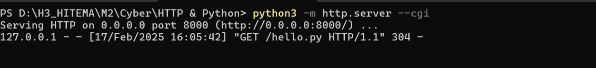
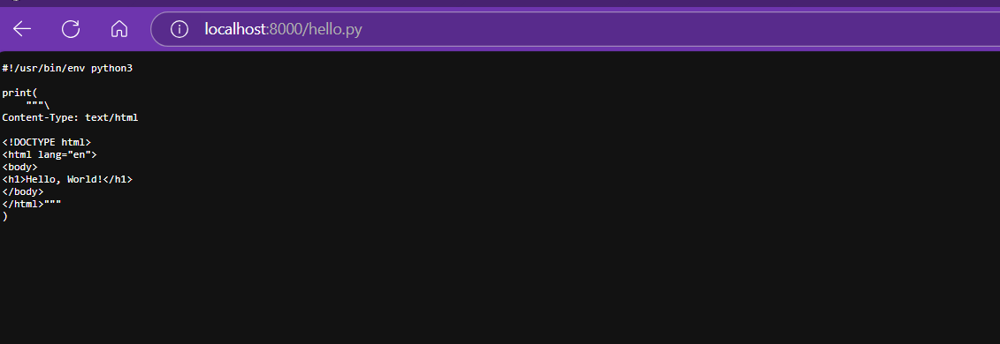
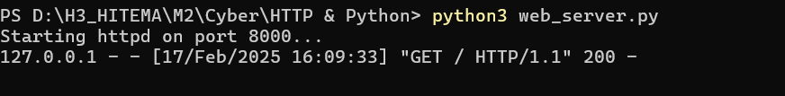
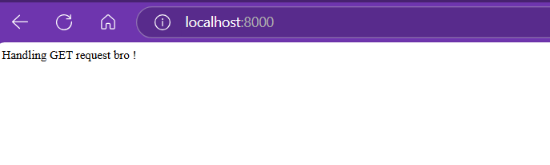

# Mise en place d'un Serveur HTTP Python avec CGI

Ce document décrit comment configurer un serveur HTTP simple en Python avec le support de CGI (Common Gateway Interface), permettant de servir du contenu dynamique.

## Prérequis

*   Python 3.x installé
*   Un éditeur de texte
*   Un terminal ou invite de commande

## Étapes

1.  **Créer un script CGI (exemple : `hello.py`) :**

    Utilisez un éditeur de texte pour créer un fichier `hello.py` 

2.  **Rendre le script exécutable :**

    Dans un terminal, naviguez jusqu'au répertoire contenant le fichier `hello.py` et exécutez :

    ```
    chmod +x hello.py
    ```

    Cela permet au serveur d'exécuter le script CGI.

3.  **Démarrer le serveur HTTP avec CGI :**

    Dans le même répertoire, exécutez la commande :

    ```
    python3 -m http.server --cgi
    ```

    

    *   `python3 -m http.server` : Lance le module `http.server` pour créer un serveur HTTP de base.
    *   `--cgi` : Active le support des scripts CGI.

    Vous devriez voir un message indiquant que le serveur est en cours d'exécution, par exemple `Serving at: http://0.0.0.0:8000`.

4.  **Accéder au script CGI dans votre navigateur :**

    Ouvrez un navigateur web et entrez l'URL suivante :

    ```
    http://localhost:8000/hello.py
    ```

    Si tout est configuré correctement, vous devriez voir la page "Hello, World!".

    

## Exemple avec gestion de requêtes GET et POST

Voici un exemple de serveur HTTP personnalisé qui gère les requêtes GET et POST, analyse les paramètres de requête et les données de formulaire, et gère les cookies :

1.  **Exécuter le serveur personnalisé :**

    Sauvegardez le code dans un fichier nommé `web_server.py` et exécutez la commande :

    ```
    python3 web_server.py
    ```

    

2.  **Accéder au serveur personnalisé dans votre navigateur :**

    Ouvrez un navigateur web et entrez l'URL suivante :

    ```
    http://localhost:8000
    ```

    Vous devriez voir le message "Handling GET request bro !".

    

3.  **Envoyer une requête POST avec curl :**

    Utilisez `curl` pour envoyer une requête POST au serveur :

    ```
    curl -X POST http://localhost:8000
    ```

    Vous devriez voir le message "Handling POST request bro !" apparaître également dans votre terminal de serveur.
