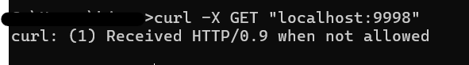
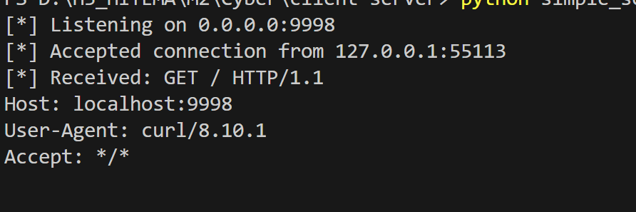
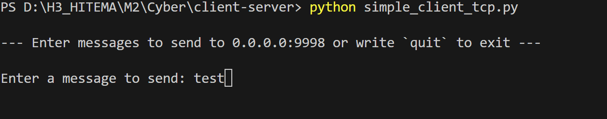

# Programmation Réseau en Python : Serveurs et Clients TCP et UDP

Ce dépôt contient des implémentations simples de serveurs et clients TCP et UDP en Python, démontrant les concepts de base de la programmation réseau.

## Table des Matières

1. [Serveur et Client TCP](#serveur-et-client-tcp)
2. [Serveur et Client UDP](#serveur-et-client-udp)

## Serveur et Client TCP

### Serveur TCP

Le serveur TCP (`simple_server_tcp.py`) est un serveur multithread capable de gérer plusieurs connexions clients simultanément.

## Utilisation

Démarrer le serveur TCP :
   ```
   python simple_server_tcp.py
   ```




### Client TCP

Le client TCP (`simple_client_tcp.py`) peut se connecter au serveur, envoyer des messages et recevoir des réponses.

## Utilisation

Exécuter le client TCP :
   ```
   python simple_client_tcp.py
   ```



## Serveur et Client UDP

### Serveur UDP

Le serveur UDP (`udp_server.py`) démontre la nature sans connexion de la communication UDP.

## Utilisation

Démarrer le serveur UDP :
   ```
   python udp_server.py
   ```


### Client UDP

Le client UDP (`udp_client.py`) montre comment envoyer des messages à un serveur UDP et recevoir des réponses.

## Utilisation

Exécuter le client UDP :
   ```
   python udp_client.py
   ```

